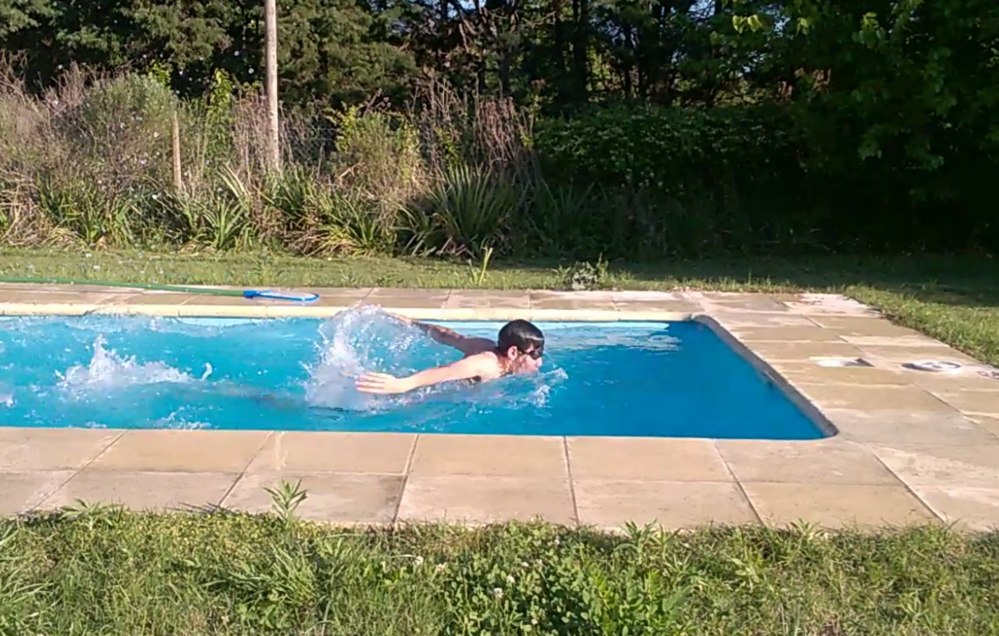

# Carlos Nahuel Lazarte
### Hola!

Soy **Carlos Nahuel Lazarte** 🙂, me dicen por mi segundo nombre, **Nahuel**. Estoy entre segundo y tercer año de la carrera.
> Legajo: **176.160-2**

# Sobre mi
- Hago natación 🏊‍♂️ desde muy chico. Mi estilo favorito es **mariposa**, me gusta la explosividad y velocidad de este estilo. También me gusta nadar en el mar y en ríos. 
- Me gusta el **arte** y la **creatividad**, creo que es una buena herramienta para usar en la ingeniería, para encontrar soluciones, que desde un enfoque sesgado por la disciplina no se encontrarían.
- Escucho todo tipo de música. Me gusta la **cumbia** del estilo Grupo Sombras, Gilda y Amar Azul. También me gusta el **cuarteto**. 

    Canciones que me parecen una **obra de arte**:
    - Libertango de Astor Piazzolla
    - Morning Mood de Peer Gynt 
    - Pirates of the Caribbean - He's a Pirate (a esta la uso en la alarma los días que tengo un examen y con eso me levanto de la cama impulsado como un cohete espacial).

  Un artista que recomiendo es [Stjepan Hauser](https://www.youtube.com/@HAUSERmusic), sus videos son EPICOOS. Se nota como siente cada tema que toca y su interpretación es muy buena. 
      
  **Me interesa el tango. Si alguien conoce algo bueno pase la data.**
- Soy habilidoso con la manos, creo que si estuviéramos en otra época sería un escultor o artesano 😂😂. Se usar todo tipo de herramientas, desde una soldadora inverter, hasta una aguja de cocer. Me doy maña con todo, te puedo colocar un estéreo o parlantes en un auto hasta una puerta en una casa 😎.
- Me gusta investigar y aprender sobre temas relacionados a la **medicina**, **psicología** y **filosofía**.
- No soy de mirar mucho películas y series, pero miro de todo, me gusta mucho la **comedia**. 
  
  Actores que me parecen muy buenos:
    
    - Diego Capusotto
    - Sebastián Presta
    - Rowan Atkinson
    - Adam Sandler
    - Jim Carrey. 
    
   
  También me gustan las **bromas con cámara oculta**.
      
- Mi comida favorita son las **empanadillas de batata** (de estas podría comer un cantidad infinita porque no son re contra dulces y no te empalagás) y las **empanadillas de cayote** (con 2 ya estoy). Tirando más a lo salado, me gusta la **bondiola de cerdo** y el **pan de campo** (con una mermelada de higo o frutilla re contra va 👌).
- Una cosa que me interesa es el **alto rendimiento deportivo**. Este año quiero llegar bien preparado para una competición de natación sin descuidar la facu. Si alguien tiene experiencia con esto, no me vendría mal ayuda. Yo también aprendí un par de cosas y puedo ayudar. 
      
# Relacionado a la ingeniería y carrera
- Me gusta la **electrónica** en general. La cosas **inalámbricas** y a **control remoto** me parecen geniales 😃. Algo que me gustaría hacer y que algún día haré es un transmisor FM para hacer un sistema de sonido con varios amplificadores que tengan un receptor FM, para distribuir el sonido por toda mi casa sin tanto cablerio. Hasta donde sé, por bluetooth no se puede hacer algo así, es decir, transmitir de un mismo lugar y recibirlo en diferentes dispositivos a la vez.
- Arreglo **notebooks** 💻, **netbooks** y **computadoras de escritorio** 🖥️ hace más de 6 años. **También hago desbloqueos, por si a alguien le interesa.** 
- Me gusta entender los temas en **profundidad**, desde la **raíz**.  A veces, por cuestiones de plazos y tiempos esto no me es posible, pero siempre que puedo estudio de esta manera. Hago hincapié en la teoría, no solo en la practica. *Métodos hay muchos, pero principios pocos, aquel que entiende los principios puede escoger eficazmente sus métodos.*
- Me gusta y me interesan más las **aplicaciones de escritorio** y los **microcontroladores** que las **aplicaciones web**.
- Me gusta tanto el **hardware** como el **software**.
- Me interesa la **ciberseguridad**. Esta la tercera vez en el año que tengo que formatear la compu por un virus 😠. 
- Otras ramas de la ingeniería que me interesan son **mecánica**, **electrónica** e **industrial**.

Muchas gracias por leer, 

**Nahuel**

